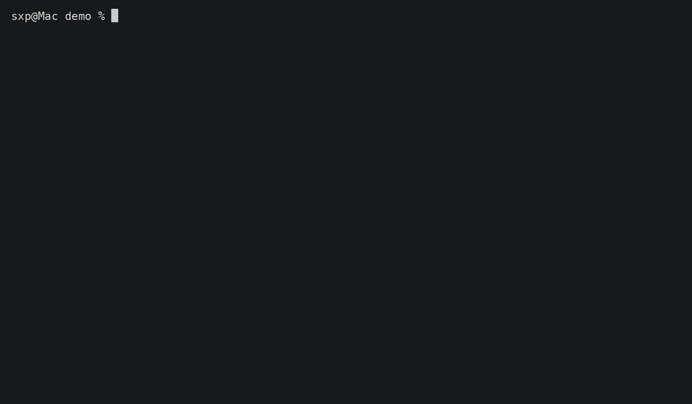

# Jenkinsfile Lint

[](https://github.com/jenkinsci/jenkinsfilelint/actions/workflows/main.yml)
[](https://codecov.io/gh/jenkinsci/jenkinsfilelint)
[](https://pypi.org/project/jenkinsfilelint)

Catch Jenkinsfile syntax errors before they break your CI.

`jenkinsfilelint` validates your Declarative Pipeline syntax via Jenkins's
[`/pipeline-model-converter/validate`](https://www.jenkins.io/doc/book/pipeline/development/#linter)
endpoint. It's primarily a [pre-commit](https://pre-commit.com/) hook, but also
works as a standalone CLI tool.

> 📖 Read the [official blog post](https://www.jenkins.io/blog/2026/06/08/jenkinsfilelint-pre-commit/) for the story behind this tool.



## Table of Contents

- [Quick Start](#quick-start)
- [Pre-commit Hook](#pre-commit-hook)
  - [Remote mode (with a Jenkins server)](#remote-mode-with-a-jenkins-server)
  - [Local mode (with Docker, no Jenkins server needed)](#local-mode-with-docker-no-jenkins-server-needed)
  - [What happens on commit](#what-happens-on-commit)
- [CLI](#cli)
- [Filtering files](#filtering-files)
- [Configuration](#configuration)
  - [Local Docker image](#local-docker-image)
- [Security](#security)
- [How It Works](#how-it-works)
- [Requirements](#requirements)
- [Contributing](#contributing)
- [License](#license)

## Quick Start

```bash
pip install jenkinsfilelint
```

Then add the pre-commit hook (see [below](#pre-commit-hook)) or use the [CLI](#cli) directly.

## Pre-commit Hook

Add the hook to your `.pre-commit-config.yaml` and install. Once configured,
every commit that touches a Jenkinsfile is automatically validated.

### Remote mode (with a Jenkins server)

```yaml
# .pre-commit-config.yaml
repos:
  - repo: https://github.com/jenkinsci/jenkinsfilelint
    rev: # use the latest or a specific version, e.g. v1.4.0
    hooks:
      - id: jenkinsfilelint
```

Set credentials via environment variables, then install:

```bash
export JENKINS_URL=https://jenkins.example.com
export JENKINS_USER=your-username
export JENKINS_TOKEN=your-api-token

pip install pre-commit
pre-commit install
```

### Local mode (with Docker, no Jenkins server needed)

```yaml
# .pre-commit-config.yaml
repos:
  - repo: https://github.com/jenkinsci/jenkinsfilelint
    rev: # use the latest or a specific version, e.g. v1.4.0
    hooks:
      - id: jenkinsfilelint
        args: ["--local"]
```

Docker (or Podman) is the only requirement — no credentials needed:

```bash
pip install pre-commit
pre-commit install
```

> The first commit pulls a minimal Jenkins container (~20–40s cold start).
> Subsequent commits reuse the running container and complete in milliseconds.

> [!IMPORTANT]
> The pre-built image includes the most common plugins (Docker agents, Git,
> credentials binding, timestamps, workspace cleanup, and pipeline utilities).
> If your production Jenkins has additional plugins that provide custom
> options, agents, or steps (e.g., ``kubernetes``, ``pipeline-github-lib``,
> ``email-ext``), local mode may still report false positives for those
> constructs. For full fidelity, either use remote mode pointing at your real
> Jenkins server, or [build a custom image](#custom-image-for-higher-fidelity)
> that mirrors your production plugin set.
>
> In short: `--local` = fast syntax gate with common plugins,
> remote / [custom image](#custom-image-for-higher-fidelity) = authoritative validation.

When you're done, stop the container:

```bash
jenkinsfilelint server stop
```

### What happens on commit

A valid file passes silently:

```bash
git commit -m "Update Jenkinsfile"
jenkinsfilelint..........................................................Passed
```

A syntax error blocks the commit with a clear message:

```bash
git commit -m "Update Jenkinsfile"
jenkinsfilelint..........................................................Failed
- hook id: jenkinsfilelint
- exit code: 1

Errors encountered validating Jenkinsfile:
WorkflowScript: 17: Expected a step @ line 17, column 11.
             test
             ^
```

Fix the error and re-commit.

## CLI

You can also run `jenkinsfilelint` directly on any file:

```bash
pip install jenkinsfilelint

jenkinsfilelint Jenkinsfile
jenkinsfilelint Jenkinsfile Jenkinsfile.prod tests/Jenkinsfile
jenkinsfilelint --local Jenkinsfile
```

## Filtering files

Use `--include` (whitelist) and `--skip` (blacklist) to control which files are validated:

```bash
# Only validate Jenkinsfiles
jenkinsfilelint --include 'Jenkinsfile*' Jenkinsfile src/Utils.groovy

# Exclude shared-library helper classes
jenkinsfilelint --skip '*/src/*.groovy' --skip 'vars/*.groovy' Jenkinsfile src/Utils.groovy
```

These work in pre-commit too:

**Exclude non-pipeline Groovy files (shared library helpers):**

```yaml
- id: jenkinsfilelint
  args: ["--skip=*/src/*.groovy", "--skip=vars/*.groovy"]
```

**Only validate files matching specific patterns:**

```yaml
- id: jenkinsfilelint
  args: ["--include=Jenkinsfile*", "--include=pipelines/*.groovy"]
```

You can also combine both — `--include` narrows first, then `--skip` removes from that set:

```yaml
- id: jenkinsfilelint
  args: ["--include=Jenkinsfile*", "--skip=*/src/*.groovy"]
```

## Configuration

Supply credentials via environment variables (recommended) or CLI flags:

| Env Variable               | CLI Flag        | Required |
|----------------------------|-----------------|----------|
| `JENKINS_URL`              | `--jenkins-url` | Yes *    |
| `JENKINS_USER`             | `--username`    | No **    |
| `JENKINS_TOKEN`            | `--token`       | No **    |
| `JENKINSFILELINT_SERVER_IMAGE` | —          | No       |

\* Not required in ``--local`` mode.
\*\* Only required if your Jenkins requires authentication (not used in ``--local`` mode).

> [!TIP]
> Even if your Jenkins allows anonymous access for validation, using an API token is recommended for production setups.

CLI flags override env vars. There is no config file.

### Local Docker image

By default, ``--local`` mode uses the official image
``ghcr.io/jenkinsci/jenkinsfilelint-server:latest``, which includes the
following plugins:

| Plugin | Provides | Common Jenkinsfile pattern
|--------|----------|---------------------------
| `pipeline-model-definition` | Declarative Pipeline validation endpoint | ``pipeline { … }``
| `configuration-as-code` | Unsecured bootstrapping (no setup wizard) | *(internal)*
| `docker-workflow` | Docker agent & steps | ``agent { docker 'maven:3-jdk-11' }``, ``docker.image('…').inside()``
| `git` | Git SCM step | ``git url: 'https://…'``, ``checkout scm``
| `credentials-binding` | Secret injection | ``withCredentials([…]) { … }``
| `timestamps` | Timestamp logging | ``options { timestamps() }``, ``timestamps { … }``
| `ws-cleanup` | Workspace cleanup | ``post { always { cleanWs() } }``
| `pipeline-utility-steps` | File/JSON/YAML utilities | ``readJSON``, ``readYAML``, ``findFiles``, ``writeJSON``, etc.

> [!NOTE]
> Adding these plugins reduces false positives for the most common
> Declarative Pipeline patterns. If your Jenkinsfile uses a plugin not listed
> here (e.g. ``kubernetes``, ``pipeline-github-lib``, ``email-ext``),
> consider building a [custom image](#custom-image-for-higher-fidelity) that
> includes it.

#### Custom image for higher fidelity

For authoritative validation that matches your production Jenkins setup, build a
custom image with your own plugin set and point to it via
``JENKINSFILELINT_SERVER_IMAGE``:

```bash
# Build a custom image with your plugins
JENKINSFILELINT_SERVER_IMAGE=my-registry/jenkinsfilelint-server:custom \
  jenkinsfilelint --local Jenkinsfile
```

##### Recipe: Export plugins from a real Jenkins

The most reliable way to build a high-fidelity image is to replicate your
production Jenkins plugin set:

```bash
# 1. Export the plugin list from your production Jenkins
#    (requires an admin token — Script Console at /script in the Jenkins UI)
curl -s -u "user:token" "$JENKINS_URL/script" \
  --data-urlencode 'script=Jenkins.instance.pluginManager.plugins.each{println("${it.shortName}")}' \
  | grep -oP '(?<=<pre>)[^<]+' \
  > plugins.txt 2>/dev/null

# Also works via the Jenkins CLI:
# java -jar jenkins-cli.jar -s $JENKINS_URL -auth user:token list-plugins | awk '{print $1}' > plugins.txt
```

```dockerfile
# 2. Create a Dockerfile that inherits from jenkinsfilelint-server or from
#    jenkins/jenkins:lts-jdk21 directly
FROM ghcr.io/jenkinsci/jenkinsfilelint-server:latest

# (Optional) Override the plugin list entirely instead of inheriting
COPY plugins.txt /usr/share/jenkins/ref/plugins.txt
RUN jenkins-plugin-cli --plugin-file /usr/share/jenkins/ref/plugins.txt
```

```bash
# 3. Build and use your custom image
#    (Tag it whatever you like — it doesn't need to be pushed to a registry)
docker build -t my-company/jenkinsfilelint-server:custom .

# Use it
JENKINSFILELINT_SERVER_IMAGE=my-company/jenkinsfilelint-server:custom \
  jenkinsfilelint --local Jenkinsfile
```

> [!TIP]
> A full production plugin list can be large (~100+ plugins). Every plugin
> increases image build time and size. The pre-built image provides a balanced
> set of common plugins. Use a custom image only when you need to validate
> constructs from less common plugins.
>
> The ``kubernetes`` plugin is a common addition for teams using
> ``agent { kubernetes { … } }`` — add it to your custom image if needed.

## Security

> [!WARNING]
> Never hardcode credentials in config files — use environment variables.

- **Never** put `--token` or `--username` in `.pre-commit-config.yaml` — use environment variables.
- Use an API token, not your password.
- A regular user token with read access is sufficient — no need for admin privileges.

## How It Works

`jenkinsfilelint` POSTs your Jenkinsfile to Jenkins's
`/pipeline-model-converter/validate` endpoint and reports whether the syntax is
valid. That's it — it only answers: **"Will Jenkins accept this syntax?"**

- **Remote mode**: validates against your existing Jenkins server using the URL
  and credentials you configure.
- **Local mode** (`--local`): automatically starts a lightweight Jenkins
  container (via Docker or Podman) and validates against it. The container is
  reused across runs for near-instant validation.

## Requirements

- Python 3.10+
- For remote mode: a Jenkins server with the Pipeline plugin installed
- For ``--local`` mode: [Docker](https://docker.com) or [Podman](https://podman.io)

## Contributing

See [CONTRIBUTING.md](CONTRIBUTING.md).

## License

MIT — see [LICENSE](LICENSE).
